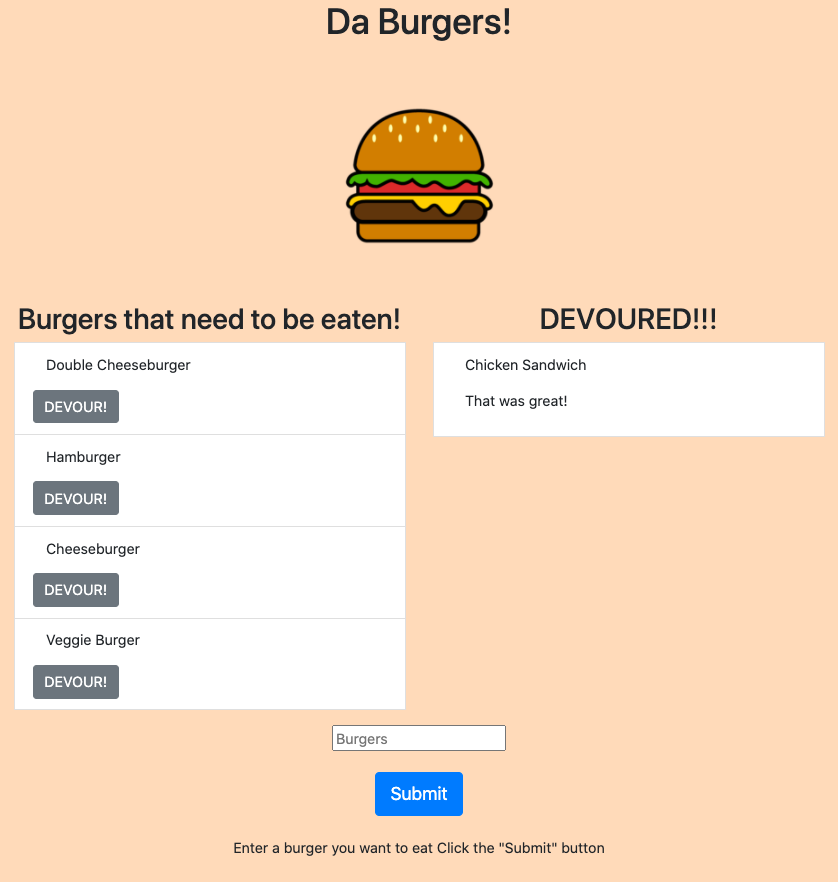

# Da-Burger!

  

  ## Description

  I created an application that essentially was a logger for burgers. Utilizing MySQL, node, express, handlebars.js, and an ORM file I used MVC design pattern to create Da-Burger!

  ## Table of Contents

  -[Installation](#installation)

  -[Usage](#Usage)

  -[License](#license)

  -[Contributing](#contributing)

  -[Tests](#tests)

  -[Questions](#questions)
  
  -[Demonstration](#demonstration)

  ## Installation

  npm i express, npm i express-handlebars, npm i mysql

  ## Usage

  Be careful and create your own branch

  ## License

  This project is licensed under [MIT](https://opensource.org/licenses/MIT) license.

  ## Contributing

  Be Careful

  ## Tests

  TBD

  ## Questions

  If you have any questions about the repo, open an issue or contact me directly at egomezfax19@gmail.com. You can find more of my work at [www.github.com/egome019](https://github.com/egome019)

## Demonstration
  [Click here](https://pacific-sands-57312.herokuapp.com/) to be directed to the application.
  

  
